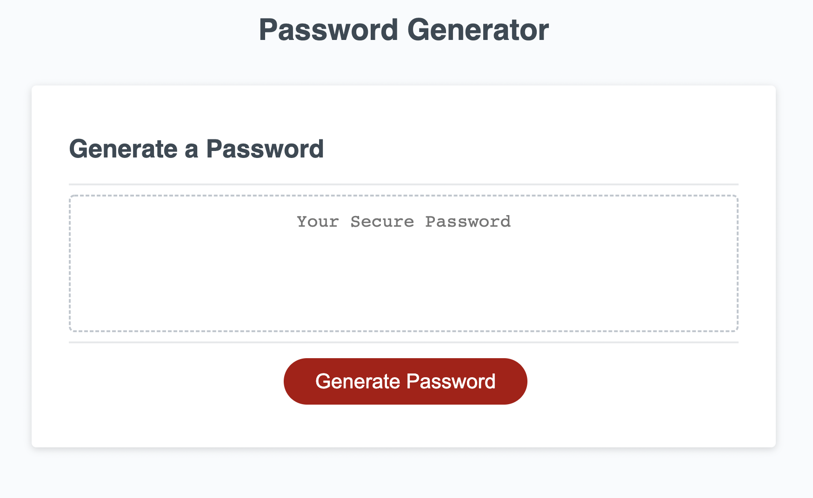
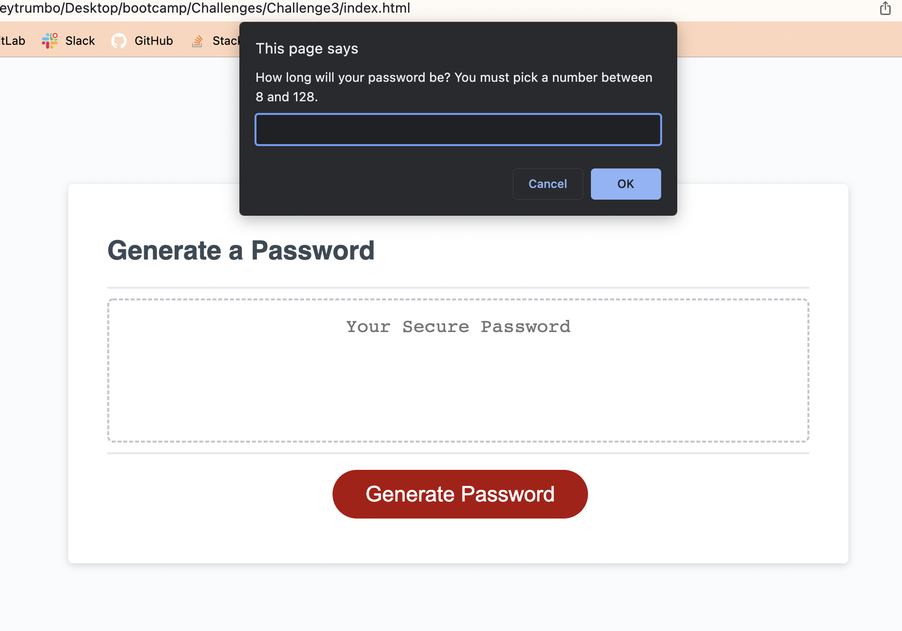
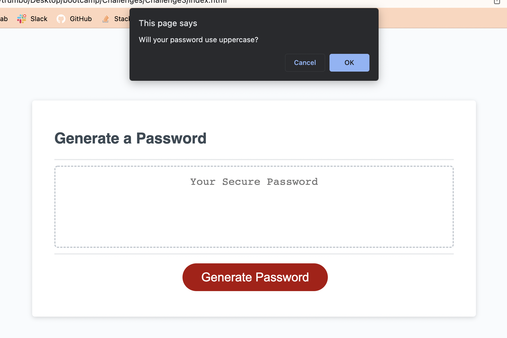
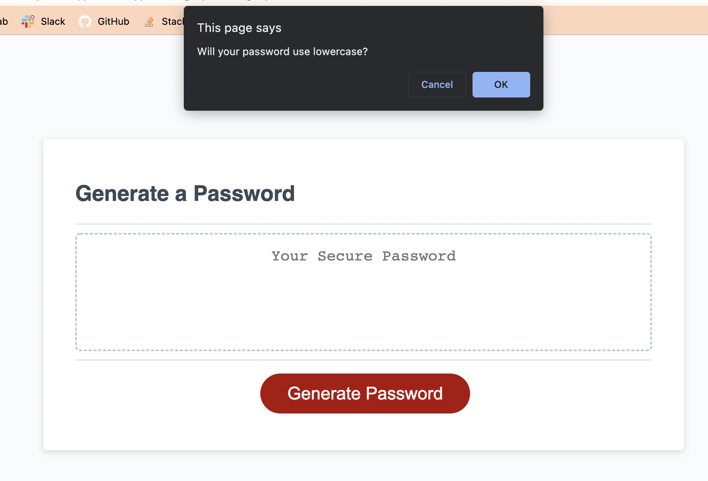
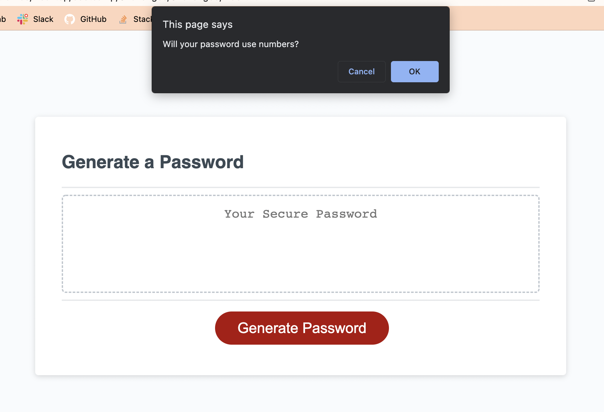
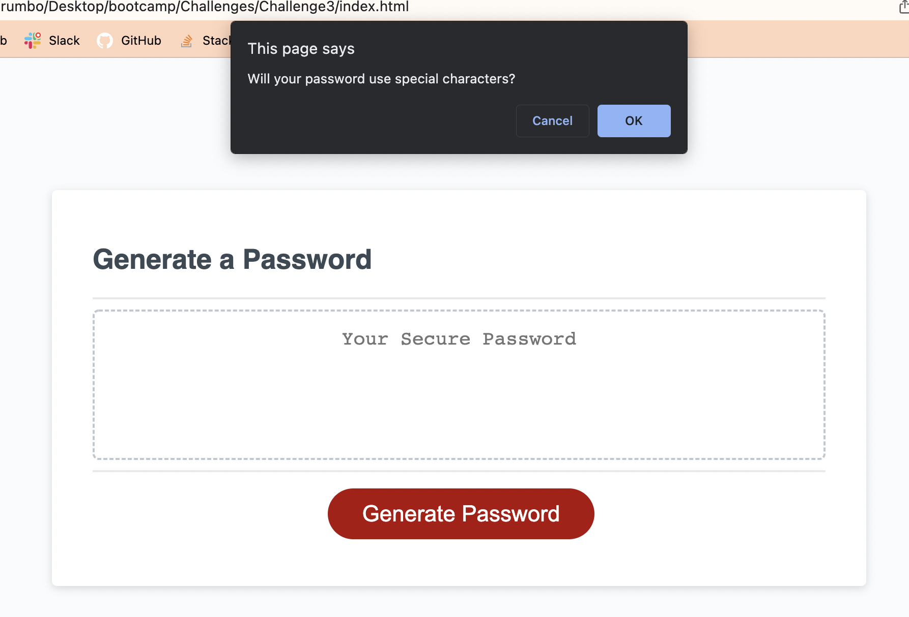
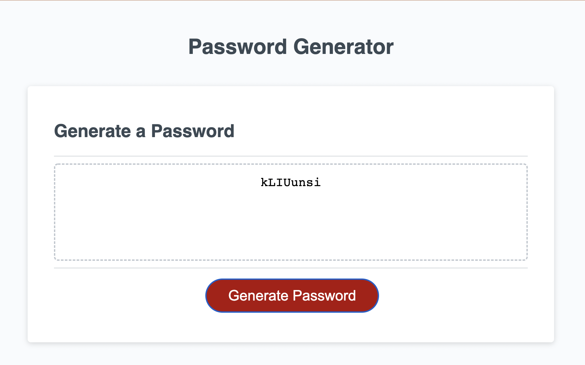

# Challenge3

## Description

I was given an HTML and CSS code that created the layout of a random password generator. I was given a starter javascript code that I needed to edit to make the random password generator work according to specific criteria according to the user. I created prompts that asked the user if they wanted uppercase, lowercase, numbers, and symbols. I then created a function that worked specific to the user's answers to the prompts and created a random passowrd for the user.

### Links

Deployed Site URL: []

#### Screenshot

# Challenge3